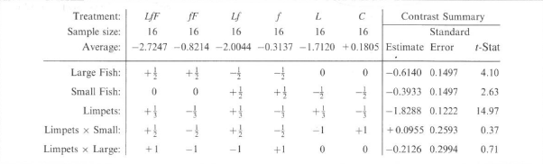

The following treatments are conducted $LfF$, $fF$, $Lf$, $f$, $L$ and $C$. 

- $LfF$: This treatment has a cage but it excludes no grazers  
- $fF$: Limpets are excluded by a caustic paint strip  
- $Lf$: Large fish are excluded by a coarse net of wire  
- $f$: Limpets and large fish are excluded  
- $L$: Small and large fish are excluded by a fine net of wire  
- $C$: Limpets, small fish, and large fish are excluded  




# Uploading Data
```{r}
seaweed <- readRDS(file="seaweed.RDS")
# Matching data to Display 13.13
seaweed$Treat<- factor(seaweed$Treat, levels=levels(seaweed$Treat)[c(4,6,3,5,2,1)])
```

# Sum-to-Zero Constraint to "Treat"
```{r}
contrasts(seaweed$Treat)<-contr.sum(levels(seaweed$Treat))
```


## Question 1

Do limpets have a different effect when large fish are present than when large fish are not present? How big is this difference?

(i) Conducting a null and alternative hypotheses, test statistic, p-value and conclusion with $\alpha = 0.05$. 

$$
\begin{aligned}
\gamma_{5} &= C_{5}\beta = \mu_{LfF} - \mu_{fF} + \mu_{f} - \mu_{Lf} \\
             &= \mu_{1} - \mu_{2} + \mu_{4} - \mu_{3} \\
             &= \beta_{1} - \beta_{2} + \beta_{4} + \beta_{3} \\
             &= \beta_{LfF} - \beta_{fF} + \beta_{f} - \beta_{Lf} \\
             &= (\beta_{1} - \beta_{2}) - (\beta_{3} - \beta_{4}) \quad \text{Sum-To-Zero}
\end{aligned}
$$


```{r}
library(gmodels)
seaweedsc.lm<-lm(log(Cover/(100-Cover))~ Block+ Treat, data=seaweed)
Cmat<--c("Treat1"=1,"Treat2"=-1, "Treat3"=-1,"Treat4"=1,"Treat5"=0)
d<-0
est<-estimable(obj=seaweedsc.lm,cm=Cmat, beta0=d,conf.int=0.95)
rownames(est) 

rownames(est)<-NULL
est
```


(i):

- Null Hypothesis ($H_{0}$) = Limpets do not have a different effect when large fish are present compared to when they are not present. 

- Alternative Hypothesis ($H_{a}$) =  Limpets do have a different effect when large fish are present compared to when they are not present.

- Test statistic: 
The test statistic is a **t-value**, calculated as:

\[t = \frac{\text{Estimate}}{\text{Std. Error}}\]

From the given data:

- **Estimate** (\( \beta_0 \)): \( 0.212515 \)
- **Standard Error**: \( 0.2994314 \)

\[t = \frac{0.212515}{0.2994314} \approx 0.71\]

- P-value : the **p-value** is found to be: \[\text{p-value} = 0.4799\]

- Conclusion: The p-value (0.4799) is greater than the significance level $\alpha = 0.05$ . Thus, there's not enough evidence (fail) to reject the null hypothesis. There is no statistically significant evidence that limpets have a different effect when large fish are present compared to when they are not present.

(ii) 95% confidence interval for this effect. 

The 95% confidence interval suggests that the true effect of limpets, when large fish are present compared to when they are not present, could lie between $-0.383042$ and $0.808072$. Since this interval includes 0, it means the effect is not statistically significant at the $5\%$ significance level ($\alpha = 0.05$). This aligns with the conclusion of the hypothesis test: there is no significant evidence that limpets have a different effect in the presence versus the absence of large fish.


# Question 2
Do small fish have an effect on the regeneration ratio? How big is this effect? 

(i) Conducting a null and alternative hypotheses, test statistic, p-value and conclusion with $\alpha = 0.05$.

$$
\begin{aligned}
\gamma_{2} &= C_{2}\beta = \frac{1}{2} (\mu_{Lf} - \mu_{L}) + \frac{1}{2} (\mu_{f} - \mu_{C}) \\
             &= \frac{1}{2} (\mu_{3} - \mu_{5}) + \frac{1}{2} (\mu_{4} - \mu_{6}) \\
             &= \frac{1}{2} (\beta_{3} - \beta_{5}) + \frac{1}{2} (\beta_{4} - \beta_{6})\\
             &= \frac{1}{2} (\beta_{Lf} - \beta_{L}) + \frac{1}{2} (\beta_{f} - \beta_{C}) \\
             &= \frac{1}{2} (\beta_{1} + \beta_{2} + 2\beta_{3} + 2\beta_{4}) \quad \text{Sum-To-Zero}
\end{aligned}
$$

```{r}
library(gmodels)
seaweedsc.lm<-lm(log(Cover/(100-Cover))~ Block+ Treat, data=seaweed)
Cmat<--c("Treat1"=1/2,"Treat2"=1/2, "Treat3"=1,"Treat4"=1,"Treat5"=0)
d<-0
est<-estimable(obj=seaweedsc.lm,cm=Cmat, beta0=d,conf.int=0.95)
rownames(est) 

rownames(est)<-NULL
est
```

(i):

- Null Hypothesis ($H_{0}$) = small fish doesn't have an effect on the regeneration ratio. 

- Alternative Hypothesis ($H_{a}$) =  small fish does have an effect on the regeneration ratio. 

- Test statistic: 
The test statistic is a **t-value**, calculated as:

\[t = \frac{\text{Estimate}}{\text{Std. Error}}\]

From the given data:

- **Estimate** (\( \beta_0 \)): \( 0.3932637 \)
- **Standard Error**: \( 0.1497157 \)

\[t = \frac{0.3932637}{0.1497157} \approx 2.63\]

- P-value : the **p-value** is found to be: \[\text{p-value} = 0.0103\]

- Conclusion: The p-value (0.0103) is smaller than the significance level $\alpha = 0.05$ . Thus, reject the null hypothesis. There is some statistically evidence that there's indeed an effect on the regeneration ratio when small fish are present. 

(ii) 95% confidence interval for this effect. 

The 95% confidence interval suggests that when small fish are present compared to when they are not present, could lie between $0.09548521$ and $0.6910422$. Since this interval does not include 0, it confirms that the presence of small fish has a moderate but statistically significant positive effect on the regeneration ratio.


# Question 3
Do limpets have an effect on the regeneration ratio? How big is this effect? 

(i) Conducting a null and alternative hypotheses, test statistic, p-value and conclusion with $\alpha = 0.05$.

$$
\begin{aligned}
\gamma_{3} &= C_{3}\beta = \frac{1}{3} (\mu_{LfF} - \mu_{fF}) + \frac{1}{3} (\mu_{Lf} - \mu_{f}) + \frac{1}{3} (\mu_{L} - \mu_{C}) \\
             &= \frac{1}{3} (\mu_{1} - \mu_{2}) + \frac{1}{3} (\mu_{3} - \mu_{4}) + \frac{1}{3} (\mu_{5} - \mu_{6}) \\
             &= \frac{1}{3} (\beta_{1} - \beta_{2}) + \frac{1}{3} (\beta_{3} - \beta_{4}) + \frac{1}{3} (\beta_{5} - \beta_{6})\\
             &= \frac{1}{3} (\beta_{LfF} - \beta_{fF}) + \frac{1}{3} (\beta_{Lf} - \beta_{f}) + \frac{1}{3} (\beta_{L} - \beta_{C}) \\
             &= \frac{2}{3}(\beta_{1} + \beta_{3} + \beta_{5})  \quad \text{Sum-To-Zero}
\end{aligned}
$$


```{r}
library(gmodels)
seaweedsc.lm<-lm(log(Cover/(100-Cover))~ Block+ Treat, data=seaweed)
Cmat<--c("Treat1"=2/3,"Treat2"=0, "Treat3"=2/3,"Treat4"=0,"Treat5"=2/3)
d<-0
est<-estimable(obj=seaweedsc.lm,cm=Cmat, beta0=d,conf.int=0.95)
rownames(est) 

rownames(est)<-NULL
est
```

(i):

- Null Hypothesis ($H_{0}$) = Limpets don't have an effect on the regeneration ratio. 

- Alternative Hypothesis ($H_{a}$) =  Limpets does have an effect on the regeneration ratio. 

- Test statistic: 
The test statistic is a **t-value**, calculated as:

\[t = \frac{\text{Estimate}}{\text{Std. Error}}\]

From the given data:

- **Estimate** (\( \beta_0 \)): \( 1.828819 \)
- **Standard Error**: \( 0.1222424 \)

\[t = \frac{1.828819}{0.1222424} \approx 14.96\]

- P-value : the **p-value** is found to be: \[\text{p-value} = 0\]

- Conclusion: The p-value (0) is smaller than the significance level $\alpha = 0.05$ . Thus, reject the null hypothesis. There is statistically evidence that there's an effect on the regeneration ratio when limpets are present. 

(ii) 95% confidence interval for this effect. 

The 95% confidence interval suggests that when limpets are present compared to when they are not present, could lie between $1.585684$ and $2.071954$. Since this interval contains only positive values, it confirms that the effect is statistically significant. This aligns with the conclusion of the hypothesis test, providing strong evidence that the presence of limpets has a highly significant positive impact on the regeneration ratio.


# Summary
Three research questions were addressed using the sum-to-zero constraint method. The first question, demonstrate that the presence or absence of large fish does not influence the impact of limpets on the regeneration ratio.The second question shows that small fish have a modest positive effect on the seaweed regeneration ratio. The third question highlights that limpets play a major positive role in boosting the regeneration ratio of seaweed. 
